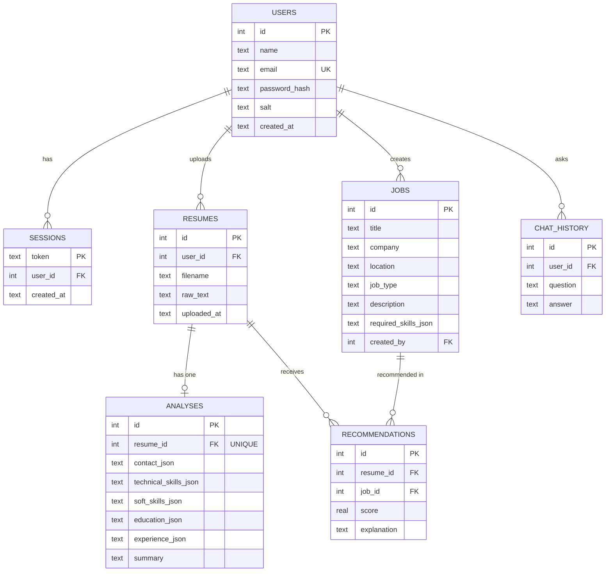

# ER Diagram

The knowledge base (skills, roadmaps, guidelines, learning resources) lives in `data/*.json` and is indexed in memory by the RAG retriever; job descriptions in the `jobs` table are added to the index at query time.
